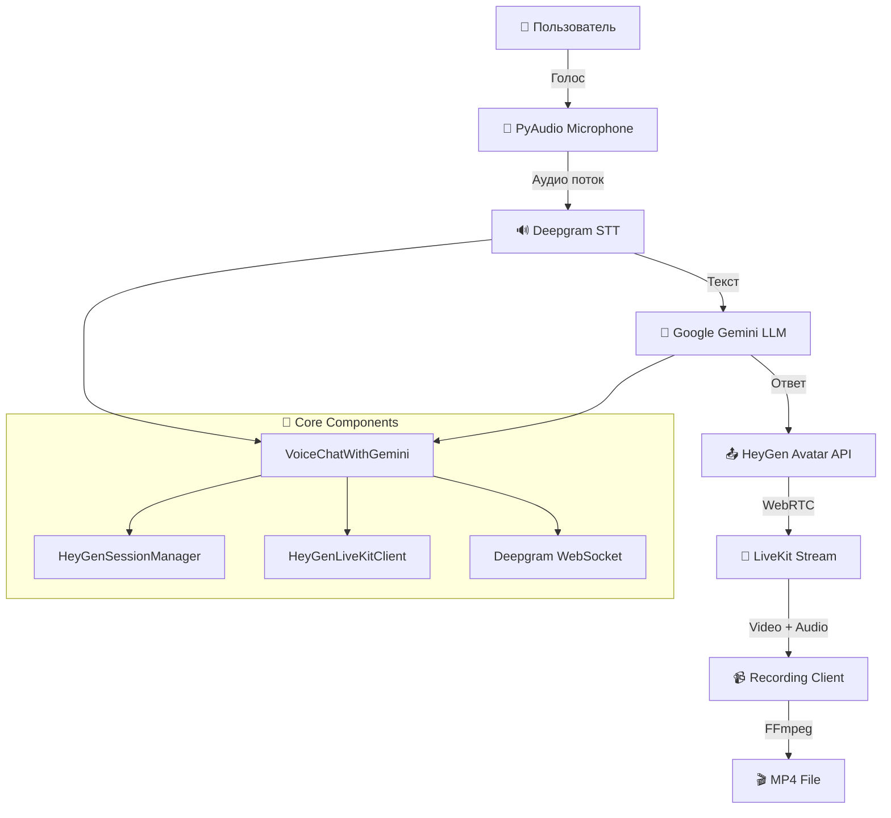
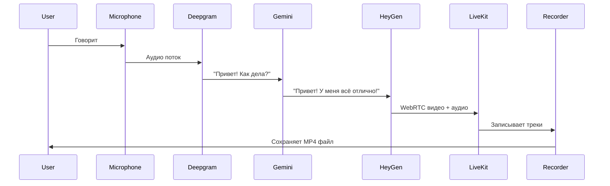

# 🏗️ Архитектура системы HeyGen Avatar Chat

## 📊 Обзор архитектуры



## 🔧 Компоненты системы

### 1. 🎤 Audio Input Layer

#### PyAudio Microphone
- **Файл**: `voice_chat_gemini.py` → `Microphone` class
- **Функция**: Захват звука с микрофона
- **Формат**: 16kHz, 16-bit, моно
- **Библиотека**: `pyaudio`, `deepgram`

```python
self.microphone = Microphone(self.deepgram_connection.send)
```

### 2. 🔊 Speech-to-Text Layer

#### Deepgram WebSocket Client
- **Файл**: `voice_chat_gemini.py` → `setup_deepgram_connection()`
- **API**: Deepgram Nova-2 model
- **Язык**: Русский (ru)
- **Режим**: Real-time streaming

**Поток данных:**
```
Микрофон → WebSocket → Deepgram → Транскрипт → Message Queue
```

### 3. 🧠 LLM Processing Layer

#### Google Gemini Integration
- **Файл**: `voice_chat_gemini.py` → `generate_llm_response()`
- **Модель**: `gemini-1.5-flash`
- **Библиотека**: `google-generativeai`
- **Обработка**: Асинхронная в отдельном потоке

```python
response = self.gemini_model.generate_content(user_message)
```

### 4. 👤 Avatar Generation Layer

#### HeyGen Session Manager
- **Файл**: `heygen/session_manager.py`
- **Функции**: 
  - Создание сессий
  - Отправка задач
  - Управление WebRTC
- **API**: HeyGen Streaming API v1

**Жизненный цикл сессии:**
```
Create Session → Start Session → Send Tasks → Close Session
```

### 5. 📡 WebRTC Streaming Layer

#### LiveKit Integration
- **Файл**: `pipecat_integration/livekit_client.py`
- **Протокол**: WebRTC over WebSocket
- **Треки**: Video (VP8) + Audio (Opus)
- **URL**: `wss://heygen-feapbkvq.livekit.cloud`

### 6. 📹 Recording & Processing Layer

#### Video + Audio Recording
- **Файл**: `pipecat_integration/livekit_client.py`
- **Формат видео**: VP8, 1280x720
- **Формат аудио**: WAV, 48kHz
- **Объединение**: FFmpeg

**Pipeline записи:**
```
WebRTC Stream → Video Track → frames[] → MP4
               → Audio Track → samples[] → WAV → FFmpeg Merge → Final MP4
```

## 🔄 Поток данных

### Полный цикл обработки



### 🧵 Threading Model

#### Основные потоки:

1. **Main Thread** - UI и управление
2. **Processing Thread** - Обработка сообщений из очереди
3. **Deepgram Thread** - WebSocket соединение
4. **LiveKit Thread** - WebRTC обработка
5. **Recording Thread** - Запись видео/аудио

```python
# Поток обработки сообщений
self.processing_thread = threading.Thread(
    target=self._process_messages,
    daemon=True
)
```

## 📁 Модульная структура

### Core Modules

#### `voice_chat_gemini.py` - Главный модуль
```python
class VoiceChatWithGemini:
    ├── __init__()              # Инициализация компонентов
    ├── create_session()        # Создание HeyGen сессии  
    ├── setup_livekit_connection() # Подключение к LiveKit
    ├── setup_deepgram_connection() # Настройка STT
    ├── generate_llm_response() # Генерация ответов
    ├── process_message()       # Обработка сообщений
    └── cleanup()              # Очистка ресурсов
```

#### `heygen/session_manager.py` - HeyGen API
```python
class HeyGenSessionManager:
    ├── create_session()       # POST /streaming/create_session
    ├── start_session()        # POST /streaming/start_session  
    ├── send_task()           # POST /streaming/send_task
    ├── close_session()       # POST /streaming/close_session
    └── list_sessions()       # GET /streaming/list_sessions
```

#### `pipecat_integration/livekit_client.py` - Recording
```python
class HeyGenLiveKitClient:
    ├── connect()             # Подключение к LiveKit room
    ├── start_recording()     # Начало записи
    ├── stop_recording()      # Остановка и сохранение
    ├── _save_video_frames()  # Сохранение видео
    ├── _save_audio_to_wav()  # Сохранение аудио
    └── _merge_video_audio_with_ffmpeg() # Объединение
```

## ⚡ Асинхронная обработка

### Message Queue System

```python
# Очередь сообщений между компонентами
self.message_queue = queue.Queue()

# Deepgram добавляет в очередь
def on_message(self_event, result, **kwargs):
    self.message_queue.put(sentence)

# Processing thread обрабатывает
def _process_messages(self):
    while self.is_running:
        message = self.message_queue.get()
        asyncio.run(self.process_message(message))
```

### Async/Await Pattern

```python
async def process_message(self, user_message: str):
    # 1. Генерация ответа LLM
    llm_response = await self.generate_llm_response(user_message)
    
    # 2. Отправка аватару  
    await self.session_manager.send_task(text=llm_response)
    
    # 3. Логирование
    logger.info(f"💬 Аватар получил сообщение")
```

## 🔧 Конфигурация системы

### Environment Variables
```bash
# API Keys
HEYGEN_API_KEY=xxx
DEEPGRAM_API_KEY=xxx  
GEMINI_API_KEY=xxx

# Settings
DEFAULT_AVATAR_ID=default
DEFAULT_QUALITY=medium
OUTPUT_DIR=outputs
```

### Default Settings
```python
# heygen/config.py
DEFAULT_AVATAR_ID = "default"
DEFAULT_QUALITY = "medium"
DEFAULT_VOICE_RATE = 1.0

# Audio settings
AUDIO_SAMPLE_RATE = 48000
AUDIO_CHANNELS = 1
VIDEO_WIDTH = 1280
VIDEO_HEIGHT = 720
```

## 🚦 Error Handling

### Exception Hierarchy
```python
try:
    # Основная логика
    await self.process_message(message)
except DeepgramException as e:
    logger.error(f"❌ Ошибка Deepgram: {e}")
except HeyGenAPIException as e:
    logger.error(f"❌ Ошибка HeyGen: {e}")
except Exception as e:
    logger.error(f"❌ Общая ошибка: {e}")
```

### Graceful Shutdown
```python
async def cleanup(self):
    # 1. Остановить обработку
    self.is_running = False
    
    # 2. Закрыть микрофон
    self.stop_microphone()
    
    # 3. Завершить запись
    video_file = await self.livekit_client.stop_recording()
    
    # 4. Закрыть сессию
    await self.session_manager.close_session()
```

## 📊 Performance Metrics

### Latency Breakdown
- **STT (Deepgram)**: ~200-500ms
- **LLM (Gemini)**: ~400-800ms  
- **Avatar Generation**: ~3-5s
- **Recording Processing**: ~100-200ms

### Resource Usage
- **Memory**: ~200-400MB
- **CPU**: 15-30% (во время записи)
- **Network**: ~2-5 Mbps (WebRTC)
- **Disk**: ~10-50MB/минута записи

---

## 🔮 Будущие улучшения

### Планируемые фичи
1. **Поддержка множественных аватаров**
2. **Настраиваемые голоса**
3. **Real-time потоковая передача**
4. **WebUI интерфейс**
5. **Кэширование ответов**

### Оптимизации
1. **Параллельная обработка**
2. **Compressed video encoding**
3. **Audio preprocessing**
4. **Connection pooling**

---

**🏗️ Архитектура готова к масштабированию и расширению!**
